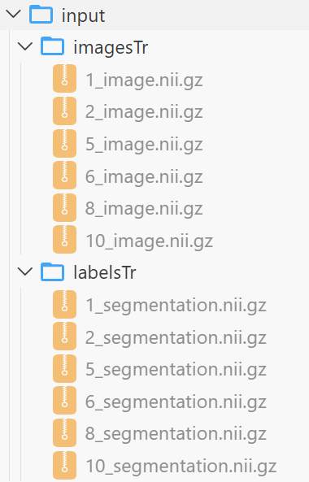
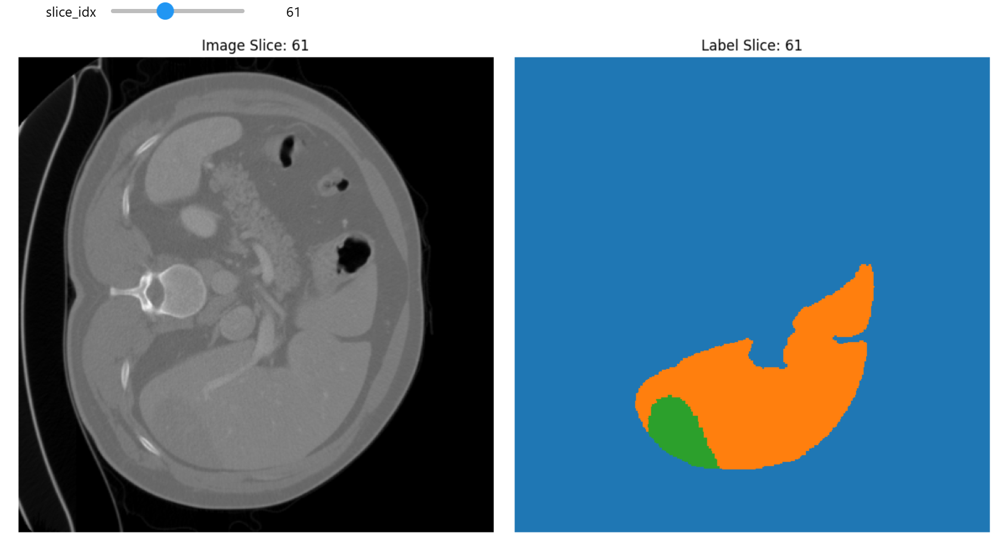

# 对SynTumor中合成肿瘤部分的复现

原项目地址：https://github.com/MrGiovanni/SyntheticTumors

原论文：https://arxiv.org/abs/2303.14869

## 0.安装

### 数据集
原项目有以下可选

- 01 [Multi-Atlas Labeling Beyond the Cranial Vault - Workshop and Challenge (BTCV)](https://www.synapse.org/#!Synapse:syn3193805/wiki/89480)
- 02 [Pancreas-CT TCIA](https://wiki.cancerimagingarchive.net/display/Public/Pancreas-CT)
- 03 [Combined Healthy Abdominal Organ Segmentation (CHAOS)](https://chaos.grand-challenge.org/)
- 04 [Liver Tumor Segmentation Challenge (LiTS)](https://competitions.codalab.org/competitions/17094)

```bash
wget https://www.dropbox.com/s/jnv74utwh99ikus/01_Multi-Atlas_Labeling.tar.gz # 01 Multi-Atlas_Labeling.tar.gz (1.53 GB)
wget https://www.dropbox.com/s/5yzdzb7el9r3o9i/02_TCIA_Pancreas-CT.tar.gz # 02 TCIA_Pancreas-CT.tar.gz (7.51 GB)
wget https://www.dropbox.com/s/lzrhirei2t2vuwg/03_CHAOS.tar.gz # 03 CHAOS.tar.gz (925.3 MB)
wget https://www.dropbox.com/s/2i19kuw7qewzo6q/04_LiTS.tar.gz # 04 LiTS.tar.gz (17.42 GB)
```

我们复现时受制于存储空间，所以仅使用了CHAOS

### 依赖

与原项目一致，代码在`python 3.8, pytorch 1.11`的环境下测试

```bash
conda create -n syn python=3.8
source activate syn (or conda activate syn)
cd SyntheticTumors
pip install external/surface-distance
pip install torch==1.11.0+cu113 torchvision==0.12.0+cu113 torchaudio==0.11.0 --extra-index-url https://download.pytorch.org/whl/cu113
pip install -r requirements.txt
```


## 1.运行

### 数据准备
我们推荐使用ct影像数据。以CHAOS数据集为例，分别取`03_CHAOS/ct/liver_label`中的数据（文件名中带segmentation）为labels，取`03_CHAOS/ct/img`中的数据为images。

在本项目文件夹下如图创建`input`文件夹与`imagesTr`和`labelsTr`文件夹，并放入数据

我们会自动将文件名中首个数字作为标识符并进行配对（例如，`1_image.nii.gz`与`1_segmentation.nii.gz`配对）

### 运行
运行`bash ./run.sh`即可，其中各个参数定义如下
- `train_dir`: 输入数据文件夹，按照上面数据准备步骤完成后为`input`
- `output_dir`: 输出数据文件夹
- `workers`: `dataloader`的`workers`参数，如果性能有余可以调高，默认为1
- `tumor_prob`: 每份数据生成肿瘤的概率，因为本项目仅展示生成效果，不用于模型训练，所以默认设置为1

### 图像浏览
进入`view.ipynb`，将最上方的文件路径修改为自己希望浏览的数据的文件相对路径
```python
file_path = 'output/imagesTr/5_image.nii.gz'
label_path = 'output/labelsTr/5_image.nii.gz'
```
然后全部运行，最下方栏会出现ct图像与标签

## 2.期望效果


如图所示，生成数据中出现了接近真实世界的肿瘤，右图可以看到liver与tumor的segmentation（需要注意，每份数据的segmentation的颜色不一定一样，即绿色不一定代表肿瘤）